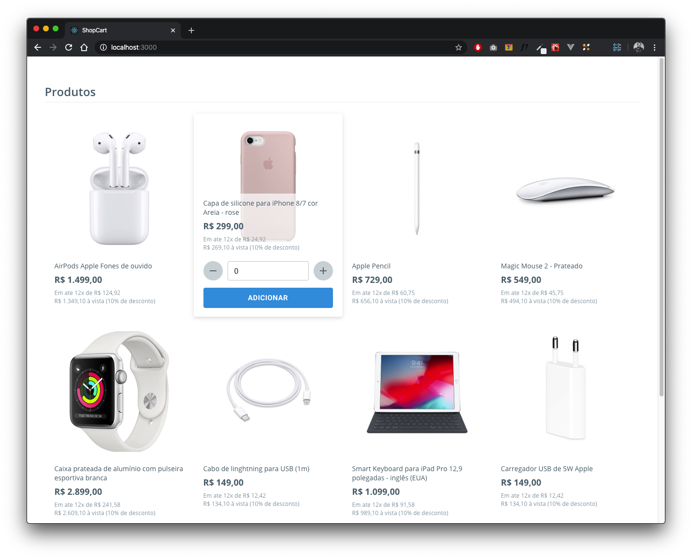
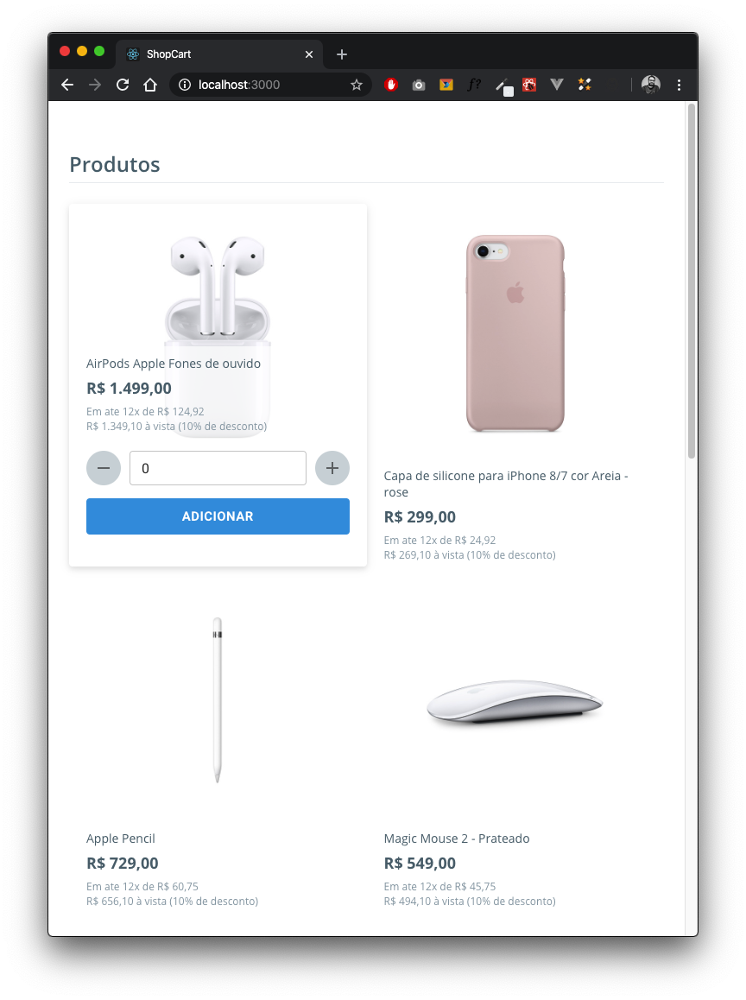
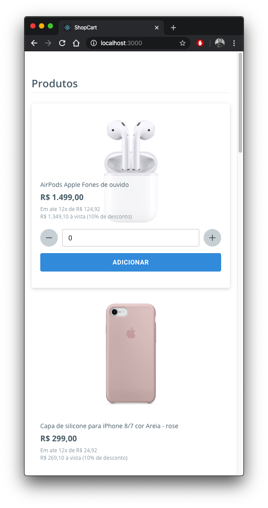

# Shop Cart

A simple shop cart made with Reactjs, Redux, Redux-Form and Material-UI.
This app was made using Toastify, Immer and others libs too.

## Screenshots

<div style="display: flex">
  
  
  
</div>

## How to use?

Clone this repo and then run this commands below in your terminal

```

$ yarn
To install dependencies using Yarn

$ yarn start
To run this app in development mode

```

### Made with :hearts: and :coffee: by Gregori Spielmann
